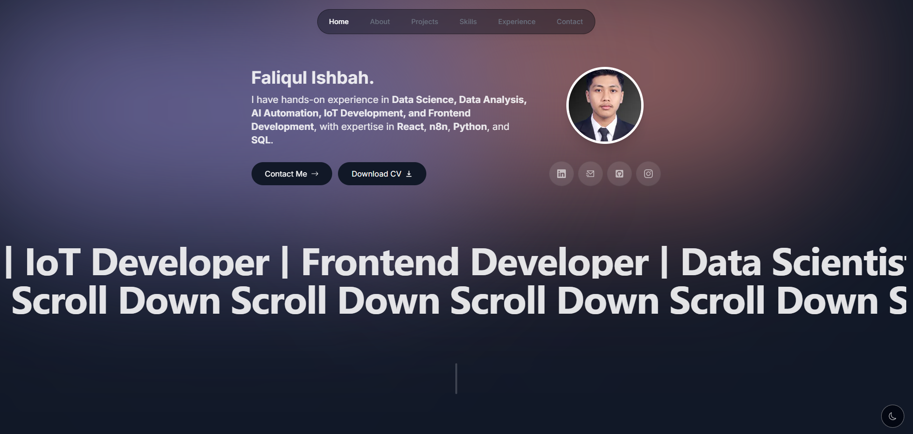

# 🚀 Web Portfolio - Faliqul Ishbah

Portfolio digital yang dirancang untuk menampilkan pengalaman, proyek, keahlian, dan perjalanan saya sebagai seorang **AI Engineer**, **Data Scientist**, **AI Automation Developer**, serta **Web Developer**.

🌐 **Live Website**  
https://faliq-portfolio.vercel.app/

---

# 📖 Tentang Portfolio

Website ini merupakan representasi digital dari perjalanan, pengalaman, dan proyek yang telah saya kerjakan. Seluruh konten dirancang agar pengunjung, recruiter, maupun kolaborator dapat mengenal saya dengan lebih mudah melalui tampilan yang modern, responsif, dan interaktif.

Portfolio ini dibangun dengan fokus pada **User Experience (UX)**, **performa**, serta **desain minimalis** sehingga nyaman diakses melalui desktop maupun perangkat mobile.

---

# ✨ Fitur Utama

<table>
<tr>
<td width="55%" valign="top">

## 🚀 Fitur

### 👋 Hero Section
- Perkenalan singkat mengenai diri.
- Informasi posisi dan bidang yang ditekuni.
- Tombol Contact Me dan Download CV.

### 👨 Tentang Saya
- Profil singkat.
- Latar belakang.
- Minat dan fokus pengembangan.

### 💼 Pengalaman
- Timeline pengalaman organisasi, magang, dan profesional.

### 🚀 Project Showcase
- Daftar project.
- Teknologi yang digunakan.
- Link GitHub & Demo.

### 🧠 Skills
- Programming Language
- Framework
- AI & Data Science
- Tools & Platform

### 📬 Contact
- Contact Form
- Email
- Social Media

### 🌙 Modern UX
- Responsive
- Framer Motion
- Dark Mode
- Mobile Friendly

</td>

<td width="45%" align="center">

</td>
</tr>
</table>

---

# 🛠️ Teknologi yang Digunakan

### Frontend
- Next.js
- React
- TypeScript
- Tailwind CSS
- Framer Motion

### Backend
- Next.js Server Actions
- Resend API

### Deployment
- Vercel

---

# 🎯 Tujuan Portfolio

Portfolio ini dibuat sebagai media untuk:

- Menampilkan pengalaman profesional.
- Mendokumentasikan proyek yang telah dikerjakan.
- Menunjukkan kemampuan teknis di bidang AI, Data Science, Automation, dan Web Development.
- Memudahkan recruiter maupun calon klien dalam mengenal profil saya.
- Menjadi pusat informasi mengenai karya dan aktivitas pengembangan yang saya lakukan.

---

# 🚀 Pengembangan Selanjutnya

Beberapa fitur yang sedang dan akan dikembangkan pada portfolio ini antara lain:

- 🤖 AI Portfolio Assistant
- 🧠 Chatbot berbasis OpenAI
- 📄 Integrasi CV
- 🎓 Integrasi Skripsi
- 📜 Halaman Sertifikat
- 📝 Blog
- 🌍 Multi Bahasa (Indonesia & Inggris)
- 🔍 Retrieval-Augmented Generation (RAG) sebagai knowledge base AI

---

# 👨‍💻 Tentang Saya

Saya adalah lulusan Informatika yang memiliki ketertarikan dalam bidang:

- 🤖 Artificial Intelligence
- 📊 Data Science
- ⚙️ AI Automation
- 🌐 Web Development
- 📱 Mobile Development
- 🌱 Internet of Things (IoT)

Saya senang membangun solusi berbasis teknologi yang dapat membantu meningkatkan efisiensi serta memberikan pengalaman pengguna yang lebih baik.

---

# 🌐 Kunjungi Portfolio

**Website**  
https://faliq-portfolio.vercel.app/

**LinkedIn**  
https://www.linkedin.com/in/faliqul-ishbah/

**GitHub**  
https://github.com/Faliqulxx

---
